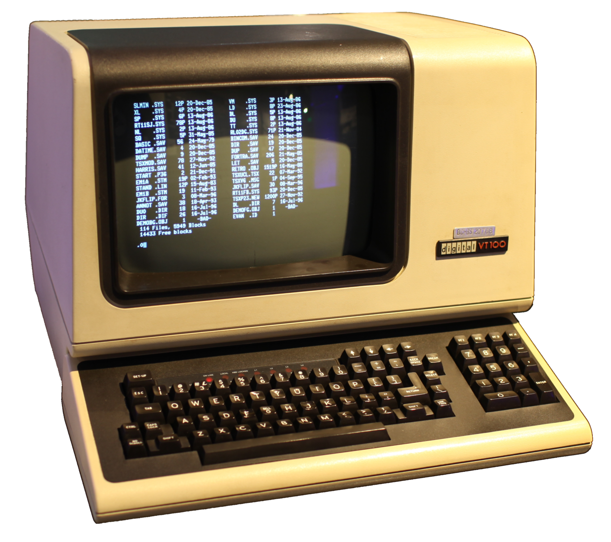

# The Terminal

## Intro and History

Back in the days before graphical user interfaces, we interacted with computers through a text-based hardware interface called the terminal. The terminal we know today is a software emulation of that hardware.

Many applications that developers use do not have a graphical user interface (GUI). You may have already used such an app if you've used *node*. Knowing one's way around the terminal is a vital skill for any developer.

## Terminology
- **The Terminal**: The terminal is a software emulation of the hardware terminals from the computer's early days.
- **The Shell**: The shell is like an operating system for the terminal. The default shell for Mac and Linux is the **Z Shell (zsh)**. PC's have two shells built-in, the **Command Prompt (CMD)** and **PowerShell**. For PC users that would like to use Linux/Mac commands, there is **GitBash**, which is included in the Git download package.
- **The Command Line**: The command line is the literal line of text before the cursor/prompt in your terminal.

## Useful Terminal Commands
1. `pwd`
   
    The `pwd` command stands for Print Working Directory. It will print the full path to the current working directory.

    ```shell
    pwd
    /Users/instructornarciso/Desktop
    ```
2. `mkdir`
   
    The `mkdir` command stands for Make Directory. Here we are creating a directory on my Desktop called `jinja`.

    ```shell
    mkdir jinja
    ```
    We can also create multiple directories using the -p option. Here we are creating three directories on my Desktop.

    ```shell
    mkdir -p puppies/pictures/majestic
    ```
3. `cd`
   
   The `cd` command stands for Change Directory. Let’s use this command to access the `majestic` directory we have created previously.

    ```shell
    cd puppies
    cd pictures
    cd majestic
    ```

    Or we can use the following command to access the `majestic` directory in one command.

    ```shell
    cd puppies/pictures/majestic
    ```
    Both commands will produce the same result. Now we should be inside the `majestic` directory.

    Now let's see how to go up one level to the `pictures` directory.

    ```shell
    cd ..
    ```

    The `cd ..` command goes up one level, to the parent directory. Now we should be in the `pictures` directory.

    Let's return to the Desktop.

    ```shell
    cd ../..
    ```

    As we can see, we can go up as many directories as we like by chaining `/..` as needed.
    ```
4. `ls` (Mac/Git Bash) `dir` (PC)
   
   The `ls` command (Mac/Git Bash) or the `dir` command (PC) lists the files and folders in the current directory. Let’s use this command to list the files and folders on the Desktop.

    ```sh
    #mac/gitbash
    ls
    ```

    ```sh
    #pc
    dir
    ```
    Now you should see a list of the files and folders on your Desktop.

    A common workflow for traversing directories in the terminal is alternating the `ls` (or `dir`) and `cd` commands until we get where we want to go.

    A useful option for the `ls` command is the `-a` option, which allows us to see hidden files.

    ```sh
    #mac/gitbash
    ls -a
    ```
    Another useful option is `-l`, which includes important details about each file and folder.files.

    ```sh
    #mac/gitbash
    ls -l
    ```
    
4. `touch` (Mac/Git Bash) `nul >` (PC)
   
   The `touch` command (Mac/Git Bash) or the `nul >` command (PC) creates a file in the current directory. Let’s use this command to create some files on our Desktop.

   First, let's a create an example project folder where our new files will live.

    ```shell
    mkdir example-project
    ```
    Now let's change directories to the newly-created folder.

    ```shell
    cd example-project
    ```
    In this folder, we can now create a file. Let's create an `index.html` file.

    ```shell
    #mac/gitbash
    touch index.html
    ```

    ```shell
    #pc
    nul > index.html
    ```
    Let's list the contents of this folder to confirm that the file has been created.

    ```shell
    #mac/gitbash
    ls
    ```

    ```shell
    #pc
    dir
    ```

    Excellent! The `touch` command accepts multiple arguments. Let's create `style.css` and `script.js` files.

    ```shell
    #mac/gitbash
    touch style.css script.js
    ```
    List contents to confirm.

    ```shell
    #mac/gitbash
    ls
    ```

    ```shell
    #pc
    dir
    ```

You have now learned the very basics of important terminal commands! Here are some more for you to look up:

- `clear` clears the terminal
- `mv` moves a file or folder (also can be used to rename a file or folder)
- `cp` copies a file to another directory
- `rm` and `rmdir` remove a file or empty directory (look up how to remove a non-empty directory!)

## Popular Third-Party Alternatives
PC:
- [Windows Terminal](https://apps.microsoft.com/detail/9N0DX20HK701?rtc=1&hl=en-us&gl=US)
- [cmder](https://cmder.app/)
- [Git Bash](https://git-scm.com/downloads)
- [Tabby](https://tabby.sh/)
- [Hyper](https://hyper.is/)
- [Alacritty](https://alacritty.org/)

Mac:
- [Warp](https://www.warp.dev/)
- [iTerm2](https://iterm2.com/)
- [Hyper](https://hyper.is/)
- [Alacritty](https://alacritty.org/)

Further reading:
[MDN Command Line Crash Course](https://developer.mozilla.org/en-US/docs/Learn/Tools_and_testing/Understanding_client-side_tools/Command_line)
